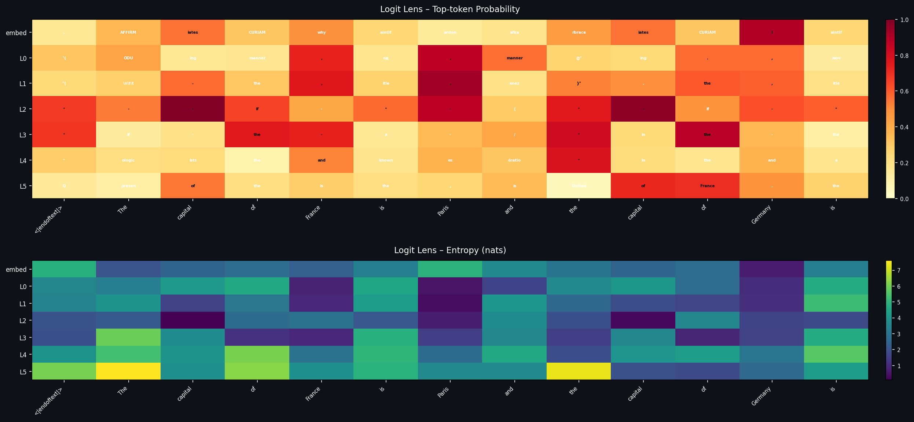
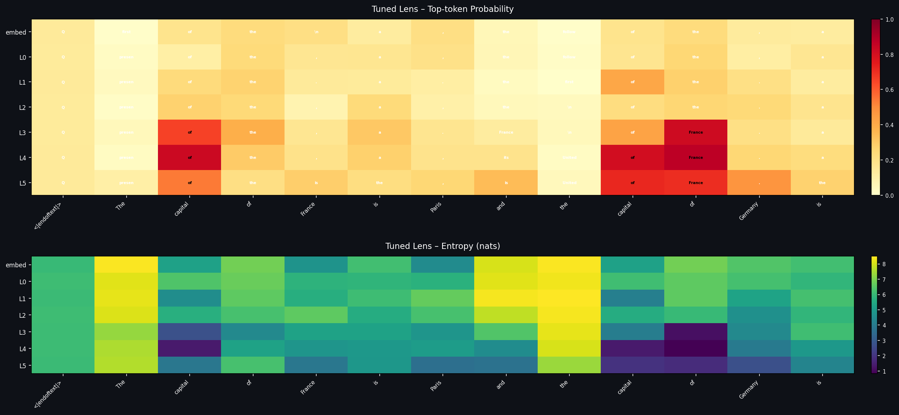

# Transformer Explainability

## Getting started

Execute both lens methods via:

```
uv sync
uv run main.py
```

View results in `outputs`. Included is an html dashboard to easily view all plots.

## Discussion
Logit and Tuned Lens provide a first step towards transformer interpretability, though each has its faults. Logit Lens is unfairly harsh on early layers due to the somewhat hamfisted approach of connecting each layer to an unpaired unembedder. Conversely, Tuned Lens may help early layers too much through the use of trained probes to project the outputs of early layers to that of the final layer.

### Logit Lens



From the token probability heatmap (top), we see Layers embed through L2 produce tokens like "AFFIRM", "CURIAM", "aintif", Cyrillic characters---complete nonsense. But the cells are deep red, meaning the model assigns high probability to these garbage tokens. Moreover, we would expect increased probabilities as we progress through the layers, but this is not the case. The entropy chart (bottom) confirms this: the logit lens has ~3 nats of entropy at early layers, which is relatively low. It's certain about the wrong things.

This is the core failure mode of vanilla logit lens on a small model. The early-layer residual stream lives in a subspace that, when directly projected through the unembedding layer, happens to land heavily on a few arbitrary vocabulary entries. This should not be interpreted as "the model thinks the next token is CURIAM at layer 0". It's an artifact of forcing a decoder onto representations it was never designed to read.


### Tuned Lens



The tuned lens produces sensible English tokens (top) from the very first layer, such as "first", "of", "the", "follow". The uniformly pale palette of the corresponding cells, however, indicates low probability for each of these tokens. The entropy chart confirms this: the tuned lens sits at ~6.5 nats through layers embed–L2, which is much higher than was seen in the logit lens results.

It is conceivable that this phenomena is an accurate reflection of how the model refines its predictions layer-by-layer. The affine probes learn that the early residual stream genuinely doesn't contain enough information to make a sharp prediction, so they produce a broad distribution over plausible English tokens rather than spiking on arbitrary garbage. As we progress towards the final layer, we see an increase in probability for most of the top tokens, with probabilities near 1 appearing as early as L3. Of course, the decoding power of the trained probe used to generate these results may present the earlier layers in a nicer light than strictly true. 